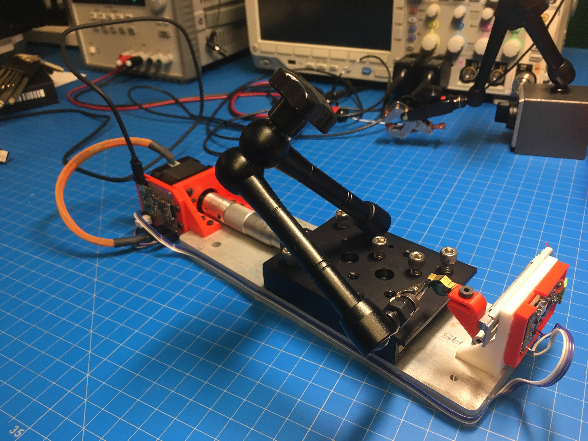
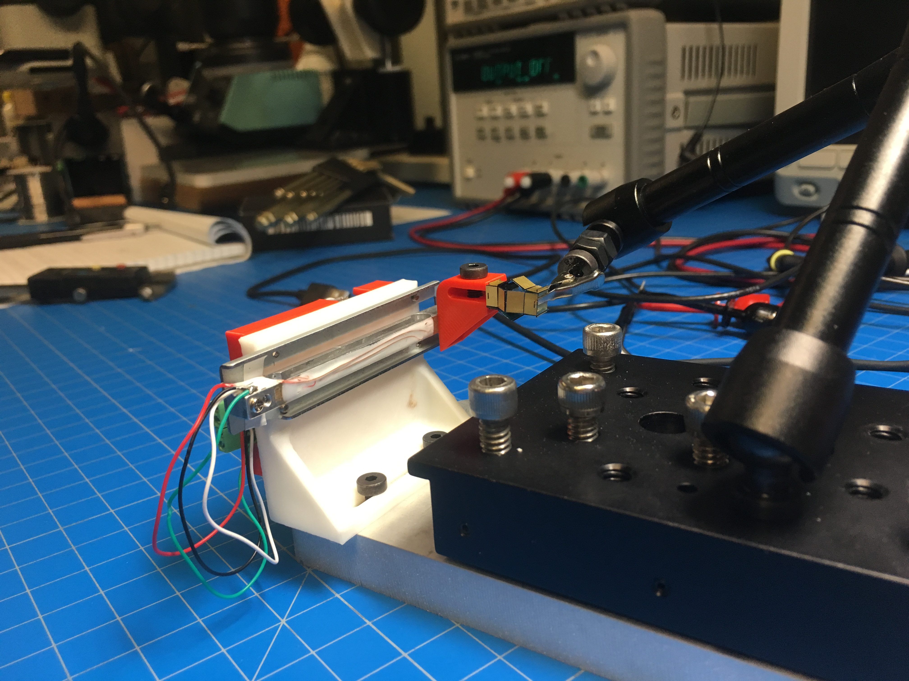
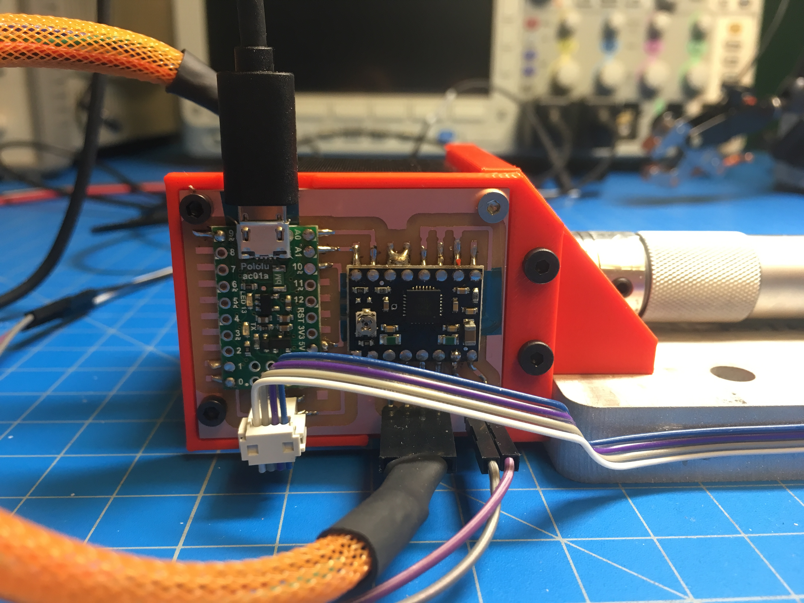
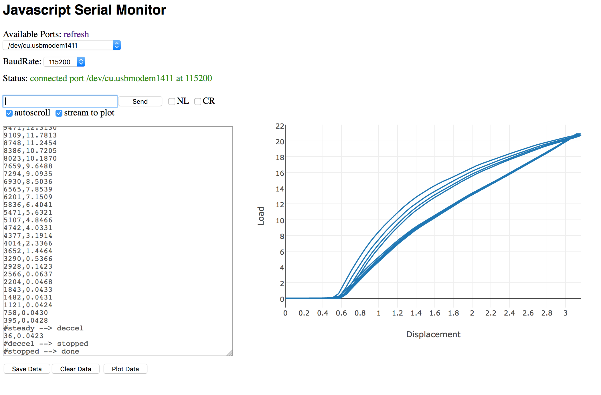

## Table-Top Instron (Force/Displacement Testing)

  

I made a table-top instron to measure milli-newton forces.

I'm using a micrometer stage that we had lying around and just machined an adaptor to attach a stepper motor to the end.

The load cell is scavenged from a low cost jewelry scale which has a range of 20g and an advertised resolution of 1mg. 

By using a 24-bit ADC and amplifier (<a href="http://www.ti.com/product/ADS1231">TI ADS1231</a>) along with oversampling 16x and decimating (see <a href="http://www.atmel.com/images/doc8003.pdf">this nice app note</a>), I can achieve better than 10mg resolution (noise is on the order of 1mg).
	

To interface with the hardware, I built a javascript/node interface. This is essentially a fancy serial monitor that enables commands to be sent to the machine, read data back, and plot it.

I'm using this machine to characterize the stiffness of small-scale flexural mechanisms, as well as the force output from electromagnetic actuators.
